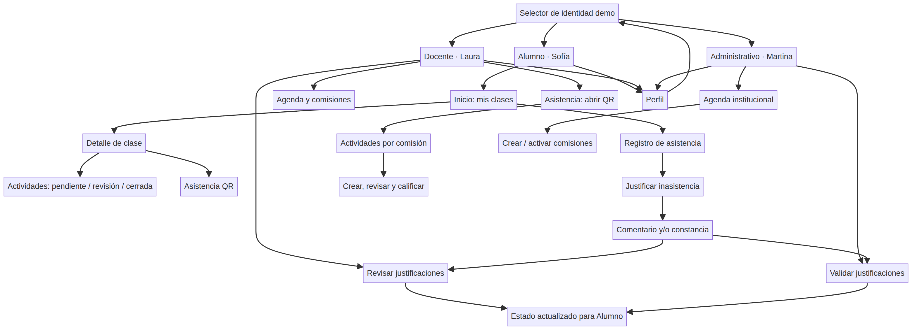

# Informe UX/UI — Asistencia Instituto

| Campo | Detalle |
|---|---|
| **Producto** | Asistencia Instituto |
| **Tipo de entrega** | Informe UX/UI de un MVP móvil para capacitación |
| **Plataformas objetivo** | iOS y Android, en orientación vertical |
| **Roles cubiertos** | Alumno, Docente y Administrativo |
| **Versión de referencia** | MVP funcional con asistencia QR, actividades, justificaciones y modo demostración |
| **Elaboración** | Síntesis del proceso de diseño, decisiones de producto, implementación y validación del proyecto |

## 1. Resumen ejecutivo

**Asistencia Instituto** es un MVP móvil pensado para un instituto de informática que centraliza la asistencia, la organización de clases y el seguimiento académico. La propuesta parte de una necesidad operativa concreta: simplificar el registro de presencia y hacer visible el estado académico para cada actor sin mezclar permisos ni sobrecargar la navegación.

El producto se organiza en tres recorridos diferenciados. El **Alumno** consulta sus clases, asistencia, actividades, calificaciones y justificaciones. El **Docente** administra sus comisiones, abre sesiones QR, publica evaluaciones o trabajos prácticos y revisa entregas. El perfil **Administrativo** opera las comisiones y valida situaciones institucionales, incluyendo justificaciones de inasistencia.

> La decisión central de UX fue reemplazar una experiencia genérica por una navegación **contextual por rol y por clase**: el usuario entra con una identidad, observa solo su contexto de trabajo y llega a la información relevante en pocos pasos.

## 2. Contexto, problema y oportunidad

El proceso de asistencia de una institución educativa suele distribuirse entre listas, planillas, mensajes y registros aislados. Esta fragmentación genera duplicación de datos, demora en las correcciones y poca visibilidad para estudiantes y docentes. Además, los trabajos prácticos, las evaluaciones y las justificaciones de inasistencia requieren trazabilidad: quién envió qué, cuándo, con qué evidencia y cuál fue la decisión posterior.

La oportunidad identificada fue crear una interfaz móvil que reduzca el trabajo administrativo de bajo valor y convierta el estado académico en información comprensible. El QR se utiliza como mecanismo de registro temporal de presencia; no reemplaza la gestión pedagógica, sino que la conecta con el historial, las actividades y las decisiones de revisión.

| Problema detectado | Decisión de diseño | Resultado esperado |
|---|---|---|
| La información de una materia aparece dispersa. | Agrupar asistencia, actividades y nota en el detalle de cada clase. | El alumno entiende su situación sin recorrer pantallas ajenas. |
| El registro presencial puede ser lento o ambiguo. | Abrir una sesión QR temporal por comisión y validar inscripción. | Registro más directo y con menor riesgo de duplicación. |
| Las entregas y las devoluciones no tienen un circuito visible. | Crear actividades por comisión y mostrar sus estados. | Seguimiento claro desde la publicación hasta la calificación. |
| Las ausencias justificadas requieren evidencia y decisión. | Permitir comentario y/o archivo; habilitar revisión por docente o administración. | Trazabilidad de la solicitud y de su resolución. |

## 3. Objetivos de experiencia

El diseño prioriza cuatro objetivos. Primero, que cada usuario identifique su situación actual al abrir la aplicación. Segundo, que las acciones frecuentes estén situadas cerca del contenido al que afectan. Tercero, que los estados importantes —pendiente, en revisión, cerrado, QR activo, justificación aprobada o rechazada— sean explícitos. Cuarto, que el prototipo sea demostrable en una capacitación sin exigir cuentas reales ni datos institucionales sensibles.

| Objetivo | Indicador de logro en el MVP |
|---|---|
| **Orientación inmediata** | Inicio con saludo, rol activo, próxima acción y acceso a secciones principales. |
| **Baja carga cognitiva** | Un rol activo por vez; las demás identidades solo reaparecen desde Perfil. |
| **Acción contextual** | Actividades dentro de la comisión o clase correspondiente, no como módulo aislado. |
| **Retroalimentación clara** | Mensajes de carga, vacíos, éxito, error y estados mediante texto, iconos y color. |
| **Demostrabilidad** | Identidades fijas de Sofía Ramírez, Laura Méndez y Martina Costa. |

## 4. Usuarios, necesidades y permisos

| Perfil | Necesidad principal | Acciones resueltas | Límites de acceso |
|---|---|---|---|
| **Alumno — Sofía Ramírez** | Conocer su situación en cada materia. | Ver clases, agenda, historial, QR, actividades, notas y justificaciones. | No crea comisiones ni modifica registros institucionales. |
| **Docente — Laura Méndez** | Gestionar la actividad de sus grupos. | Abrir QR, crear actividades, adjuntar consignas, revisar entregas, calificar y validar justificaciones de sus comisiones. | No gestiona comisiones ajenas ni la configuración institucional completa. |
| **Administrativo — Martina Costa** | Mantener la operación académica ordenada. | Crear y activar comisiones, consultar inscripciones y validar justificaciones. | No califica entregas pedagógicas salvo que el proceso institucional lo requiera. |

## 5. Arquitectura de información y flujos

La arquitectura combina cuatro pestañas persistentes —Inicio, Agenda, Asistencia y Perfil— con pantallas contextuales. Inicio concentra el resumen; Agenda permite explorar tiempo y comisiones; Asistencia contiene el flujo QR; Perfil conserva la cuenta demo y el único acceso para cambiar de identidad. Las vistas de detalle se abren únicamente cuando el usuario necesita profundizar.

### 5.1 Flujo de Alumno

El flujo comienza en **Inicio**, donde Sofía ve tarjetas de sus clases sin duplicación. Al tocar una clase accede a un detalle con asistencia, nota actual, actividades y sus estados. Desde Inicio también puede abrir el **Registro de asistencia**, filtrar movimientos y crear una justificación para una ausencia. La justificación admite comentario, archivo de hasta 5 MB o ambos; luego queda en revisión.

| Paso | Pantalla | Decisión UX |
|---|---|---|
| 1 | Inicio | Las clases se presentan como unidades de navegación, no como datos repetidos. |
| 2 | Detalle de clase | Asistencia, nota y actividades se agrupan por materia. |
| 3 | Registro de asistencia | Los filtros permiten distinguir presentes, tardanzas, ausencias y justificados. |
| 4 | Justificar inasistencia | Se explica el propósito del comentario y de la constancia antes de enviar. |
| 5 | Historial actualizado | El estudiante vuelve a una vista que comunica el estado de revisión. |

### 5.2 Flujo de Docente

Laura selecciona una comisión activa, inicia una sesión QR y visualiza los registros en vivo. Desde ese mismo contexto abre **Evaluaciones y trabajos prácticos**, donde puede publicar una nueva actividad con título, descripción, fecha límite y archivo adjunto. Cada actividad conduce a una vista de revisión de entregas para asignar nota y devolución. La revisión de justificaciones se mantiene como un flujo separado para no mezclar decisiones pedagógicas con documentación de inasistencias.

### 5.3 Flujo Administrativo

Martina accede a la agenda institucional y a la gestión de comisiones. Puede crear borradores, completar datos, activar comisiones y revisar información de inscripciones. Desde Agenda abre **Validar justificaciones de inasistencia**, donde observa solicitudes, comentarios, constancias y decisiones previas. Esta separación hace visible que la administración tiene responsabilidad de trazabilidad institucional, no de calificación académica.

## 6. Diseño visual y sistema de interfaz

La identidad visual busca transmitir institucionalidad, legibilidad y cercanía sin adoptar una estética excesivamente corporativa. Se usa una base clara para la lectura prolongada, azul oscuro para jerarquía y acciones principales, y amarillo para llamadas de atención positivas o accionables.

| Token visual | Valor | Uso principal |
|---|---:|---|
| **Azul noche** | `#0B1F3A` | Encabezados, superficies de énfasis y acciones institucionales. |
| **Gris plata** | `#D7DEE8` | Bordes, divisores y estructuras secundarias. |
| **Blanco** | `#FFFFFF` | Superficies de lectura y tarjetas. |
| **Amarillo acento** | `#F4C542` | Acción primaria, recordatorios y elementos de énfasis. |
| **Verde de éxito** | `#2E8B70` | Presencia registrada, aprobación y estados positivos. |
| **Rojo de alerta** | `#C95353` | Ausencias, rechazo y acciones de riesgo. |

Las tarjetas, bordes suaves y espaciados amplios sostienen una lectura táctil y escaneable. Los componentes interactivos usan estados de presión y los mensajes de estado combinan texto, icono y color. Esta redundancia visual es importante porque la información no depende únicamente de la diferenciación cromática, en línea con la orientación de Apple para interfaces perceptibles y adaptables.[2]

## 7. Patrones UX/UI relevantes

### 7.1 Navegación de una identidad por vez

En modo demostración, el usuario elige una identidad al inicio. Después de ingresar, no ve las otras opciones de rol en las pantallas operativas. El cambio de identidad se concentra en **Perfil → Cambiar identidad demo**. Este patrón evita cambios accidentales de contexto y sostiene una representación clara de permisos.

### 7.2 Estados académicos visibles

Las actividades del Alumno se categorizan como **pendientes de entrega**, **en espera de revisión** o **cerradas**. En el Docente, las actividades muestran cantidad de entregas y pendientes de revisión. Las justificaciones usan los estados **pendiente**, **aprobada** o **rechazada**. En todos los casos, el estado se expresa mediante etiqueta textual, icono y color.

### 7.3 Formularios y acciones críticas

Los formularios de actividad y justificación dividen la tarea en campos reconocibles: nombre, descripción, archivo y fecha, o bien motivo, comentario y constancia. Las acciones críticas —enviar una justificación, calificar, validar o rechazar— muestran etiquetas explícitas y un resultado posterior. La interfaz evita depender de gestos complejos; el patrón predominante es tocar una tarjeta o un botón visible.

### 7.4 Estados vacíos y recuperación

Cuando no existen comisiones, actividades, entregas o justificaciones, la aplicación comunica qué falta y cuál es la siguiente acción útil. En errores de archivo, QR o validación, el mensaje explica el problema y propone reintento o regreso. Esta decisión disminuye la sensación de bloqueo en un flujo de demostración y mejora la previsibilidad del producto.

## 8. Accesibilidad y usabilidad móvil

El diseño toma como referencia las Human Interface Guidelines de Apple y WCAG 2.2. Apple plantea que una interfaz accesible debe ser intuitiva, perceptible y adaptable; además recomienda controles cómodos para tocar, etiquetas claras y múltiples vías para completar acciones.[1] [2] WCAG 2.2 organiza la accesibilidad alrededor de los principios de que el contenido sea perceptible, operable, comprensible y robusto.[3]

| Aspecto | Aplicación en el MVP | Estado de madurez |
|---|---|---|
| Jerarquía y legibilidad | Encabezados, subtítulos, tarjetas y texto de ayuda. | Implementado. |
| Estados no dependientes del color | Iconos, etiquetas textuales y color en asistencia, actividades y decisiones. | Implementado. |
| Controles táctiles | Botones y tarjetas con padding y áreas de presión visibles. | Implementado; pendiente auditoría formal de tamaños en todas las pantallas. |
| Navegación coherente | Pestañas persistentes, botón de volver y ruta de cambio de identidad única. | Implementado. |
| Lectores de pantalla y Dynamic Type | Etiquetas disponibles en acciones clave; falta auditoría sistemática con VoiceOver y tamaños de texto extremos. | Pendiente de validación. |
| Contraste | Paleta institucional con roles de color consistentes. | Pendiente medición formal de contraste AA en cada combinación. |

La capacitación puede presentar este apartado como una **evaluación de diseño orientada a accesibilidad**, no como una certificación formal de conformidad. La siguiente iteración debería probar VoiceOver, Dynamic Type, navegación por teclado y contraste real en dispositivos.

## 9. Rol de la inteligencia artificial en el proyecto

La IA se utilizó como apoyo al proceso de desarrollo, no como una función engañosamente atribuida al usuario final. La contribución principal estuvo en ordenar requerimientos, comparar alternativas tecnológicas, elaborar flujos por rol, generar iteraciones de interfaz, proponer estructura de datos, producir código, escribir pruebas y ayudar a diagnosticar incompatibilidades de entorno.

| Etapa del proyecto | Aporte de IA | Criterio humano aplicado |
|---|---|---|
| Descubrimiento | Síntesis de módulos, roles y prioridades del MVP. | La autora definió el problema educativo y los alcances. |
| UX/UI | Propuestas de navegación, jerarquía, estados y consistencia visual. | Se ajustaron pantallas según observaciones sobre clases, actividades e identidades. |
| Desarrollo | Implementación de pantallas, rutas, validaciones y pruebas. | Se revisaron los recorridos y se restauraron versiones estables cuando fue necesario. |
| Calidad | Diagnóstico de errores de compilación, auditoría de enlaces y casos de prueba. | Se validó tipado, pruebas automatizadas y flujo de demostración. |
| Documentación | Estructuración de este informe y de los próximos entregables. | La autora define qué evidencia presentar en la capacitación. |

> El valor formativo no consiste solo en “usar IA para generar código”, sino en mostrar cómo se dirigió, verificó y corrigió ese apoyo dentro de decisiones de producto concretas.

## 10. Validación realizada y límites del MVP

La versión de referencia cuenta con validación de TypeScript y pruebas automatizadas para flujos de asistencia QR, actividades, comisiones, perfiles, navegación, seguimiento académico y justificaciones. La última comprobación interna registró **36 pruebas aprobadas** y una prueba de autenticación omitida por depender de sesión externa. El linter no presenta errores; sus advertencias restantes corresponden a aspectos preexistentes de estilo y dependencias de efectos.

| Área validada | Evidencia disponible |
|---|---|
| Navegación por roles | Prueba de integridad de rutas y acceso demo. |
| Asistencia QR | Sesión temporal, inscripción, duplicados y vencimiento. |
| Seguimiento del alumno | Clase contextual, estados de actividad e historial. |
| Actividades docentes | Creación, adjunto, revisión, nota y devolución. |
| Justificaciones | Comentario/archivo, estado de revisión, aprobación o rechazo. |
| Entorno técnico | Compilación TypeScript, pruebas unitarias y lint sin errores. |

El prototipo todavía debe validarse con personas reales en contexto educativo. En particular, faltan pruebas moderadas con alumnos, docentes y personal administrativo; evaluación de contraste y lector de pantalla; notificaciones reales; y una política institucional definitiva para conservación de archivos y datos personales.

## 11. Recomendaciones para la presentación en capacitación

La demostración debe ser breve y narrativa. Se recomienda iniciar con el problema, mostrar el selector de identidad y recorrer un caso completo: Sofía consulta una ausencia y envía una justificación; Laura o Martina cambian de identidad desde Perfil, abren la solicitud y la validan; finalmente se vuelve al historial del Alumno para explicar el cambio de estado. Luego se puede mostrar la creación de una actividad docente y la relación con las entregas.

| Duración orientativa | Segmento | Mensaje clave |
|---:|---|---|
| 0:00–0:40 | Contexto y desafío | Asistencia y seguimiento integrados para un instituto de informática. |
| 0:40–1:20 | Diseño por roles | Cada perfil ve solo las decisiones que le corresponden. |
| 1:20–2:10 | Alumno | Clases, actividades, historial y justificación. |
| 2:10–3:10 | Docente | QR, actividades, entregas y devolución. |
| 3:10–3:50 | Administrativo | Comisiones y validación institucional. |
| 3:50–4:30 | IA y aprendizajes | IA como copiloto, con revisión humana y pruebas. |

## 12. Próximas iteraciones priorizadas

La siguiente evolución debería enfocarse en evidencia de uso real antes de sumar muchas funciones. Se recomienda incorporar notificaciones de vencimiento y de resolución de justificaciones; permitir la entrega real de archivos por parte del Alumno; y construir un tablero administrativo con indicadores de asistencia por comisión. En paralelo, conviene formalizar pruebas de accesibilidad y privacidad antes de trabajar con datos institucionales reales.

## Referencias

[1]: https://developer.apple.com/design/human-interface-guidelines "Apple Human Interface Guidelines"

[2]: https://developer.apple.com/design/human-interface-guidelines/accessibility "Apple Human Interface Guidelines — Accessibility"

[3]: https://www.w3.org/TR/WCAG22/ "W3C Web Content Accessibility Guidelines (WCAG) 2.2"
